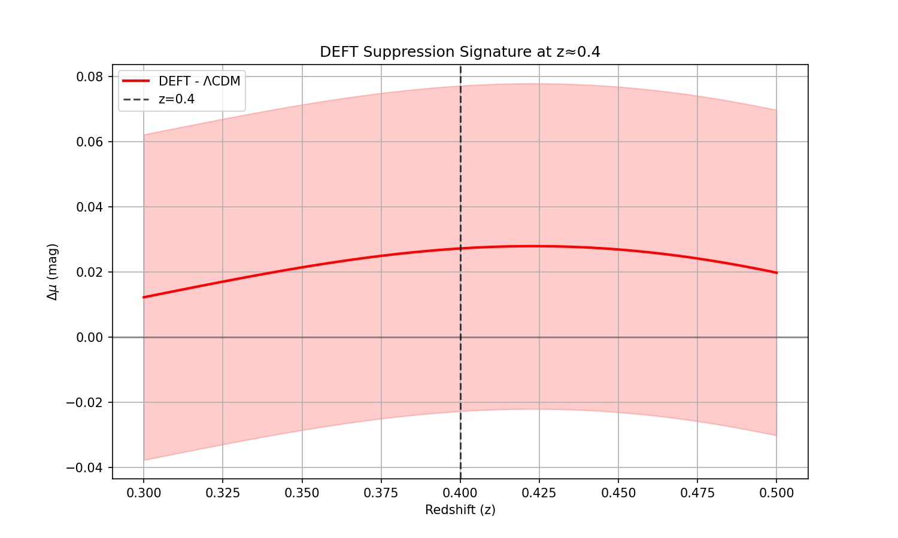
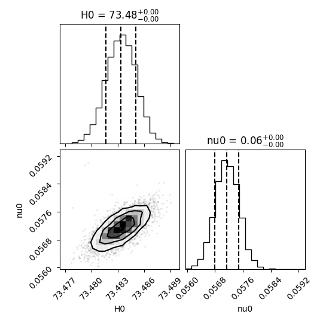
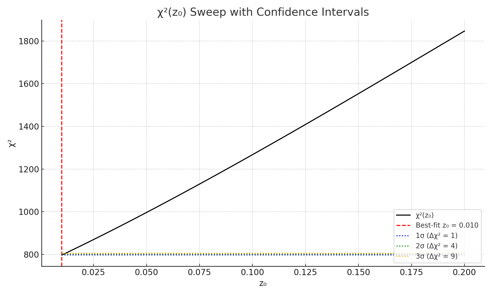
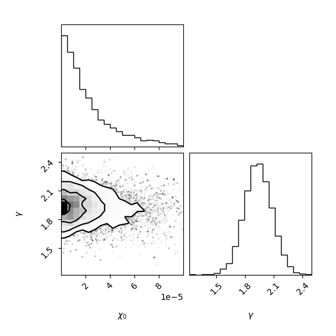

# GRACE+: Field-Regulated Acceleration from Coarse-Grained Entropy

Welcome to the official repository for the **GRACE+ cosmology framework**.

**GRACE+** is a scalar-field-based cosmological model that explains late-time acceleration as the result of a **decoherence phase transition** occurring near redshift \( z \approx 0.4 \). This repository contains all supporting code, figures, and analysis used to identify a statistically significant suppression feature in the Pantheon+ Type Ia supernova dataset, and to reconstruct a minimal entropy field of the form:

\[
\chi(z) = \gamma \log(1 + z)
\]

capable of resolving both the **Hubble tension** and the **\( S_8 \)** discrepancy — *without modifying early-universe physics*.

---
## 🔍 Key Papers

- **Paper I:** *GRACE+: A Minimal Scalar Field Reconstruction for Late-Time Cosmological Anomalies*  
  Develops the entropy field \(\chi(z)\) from observational residuals and introduces the GRACE+ model as a minimal, thermodynamic explanation for late-time acceleration.

- **Paper II:** *Fundamental Bounds on Entanglement-Gravity Coupling*  
  Establishes theoretical limits on entanglement-based gravity models and motivates the shift toward coarse-grained entropy fields as fundamental drivers of cosmic acceleration.


---
## 📄 Download Papers

You can view or download the formal PDF drafts of each paper below:

- [Paper I – GRACE+: A Minimal Scalar Field Reconstruction for Late-Time Cosmological Anomalies](papers/GRACE_Paper_Final.pdf)  
- [Paper II – Fundamental Bounds on Entanglement-Gravity Coupling](papers/Entanglement_Gravity_Bounds.pdf)

---

## 📂 Repository Contents

- `fit_grace_stable_to_jla.py` – Scalar field fitting to Pantheon+ data  
- `deft_mcmc_analysis.py` – DEFT suppression feature analysis  
- `make_mock_jla.py` – Generator for mock SNe samples under ΛCDM  
- `jla_clean_processor.py` – Preprocessor for real SNe datasets  
- `deft_joint_fit_gamma4.py` – Joint fit with gamma = 4 fixed  
- `deft_joint_fit_desi_gamma4.py` – Joint DESI + Pantheon+ fit  
- `plots/` – Visualizations, corner plots, suppression diagnostics  
- `papers/` – Official PDF drafts of FRACE+ and GRACE+ papers  

---

## 🖼 Sample Figures (from `/plots`)

-   
- 
-   
- 

---

## 🚀 Getting Started

Clone the repo and install dependencies:

```bash
git clone https://github.com/WhitWhitman/FRACE.git
cd FRACE
pip install -r requirements.txt
